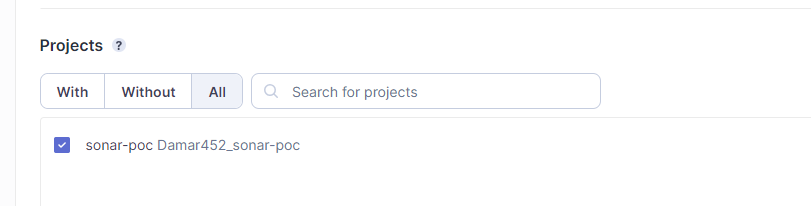

# Implementación de Sonar (propuesta)

## SonarQube vs SonarCloud

Tanto SonarCloud™ y SonarQube™ son herramientas válidas para ayudar a escribir un código seguro y de calidad en nuestros proyectos. Pero siempre puede surgir la duda, ¿qué producto es mejor para ti y tu equipo?

### SonarCloud™

- **Solución Basada en la Nube**: SonarCloud es una opción sin complicaciones, alojada en la nube, que elimina la necesidad de gestionar la infraestructura.
- **Integración con**:  GitHub.com, Azure DevOps, Bitbucket.org y GitLab.com. SonarCloud™ está alojado en SonarSource en AWS y es el camino más fácil para comenzar a escanear tu código en minutos.

### SonarQube™

- **Autohospedado**: SonarQube ofrece la flexibilidad de ser autohospedado en nuestra infraestructura, lo que permite un mayor control y personalización.
- **Integración Profunda**: Se integra fácilmente con nuestro flujo de trabajo de desarrollo, proporcionando análisis en tiempo real y permitiendo la incorporación de reglas personalizadas.

Ambas opciones ofrecen paneles de control intuitivos y detallados, proporcionando una visión holística de la salud del código. La elección entre SonarQube y SonarCloud dependerá de nuestras necesidades específicas de alojamiento y de la profundidad de integración requerida en nuestro entorno de desarrollo.

La implementación de SonarQube o SonarCloud no solo mejorará la calidad del código, sino que también fomentará prácticas de desarrollo más robustas, ayudando a identificar y corregir problemas de manera proactiva. Este enfoque contribuirá a la entrega de software más confiable y sostenible, alineándonos con estándares de calidad más elevados.

## Configuraciones 

### SonarCloud™

Para empezar este pequeño tutorial de implementación de SonarCloud en un proyecto, en este caso de Angular, lo primero que debemos tener en cuenta es la configuración del repositorio y el servicio de alojamiento que vamos a usar, para este caso vamos a estar haciendolo en Github, pero también se puede hacer en BitBucket, GitLab, Azure Devops.

1. **Como primer paso debemos crear nuestro repositorio**

2. **El segundo paso es empezar a enlazar nuestro proyecto con SonarCLoud, para esto nos dirijimos a https://sonarcloud.io/login y escogemos la opción de Github**

3. **Una vez hallamos escogido, llegamos a esta vista donde debemos importar o crear una organización para poder usar esta herramienta**

4. **Una vez realizada esta configuración nos dirijimos al apartado de Autorizaciones y verificamos que tengamos SonarCloud habilitado**

5. **Ya habiendo validado esto vamos a escoger el proyecto que creamos previamente para relacionarlo con SonarCloud**

6. **Terminamos de configurar detalles de la organización, escogemos el plan de pago y los proyectos que vamos a configurar con Sonar**

7. **Por ultimo le damos click a crear proyecto**

8. **Una vez hallamos hecho esta configuración nos redirijirá al siguiente tablero: https://sonarcloud.io/summary/overall?id={organization_id}_{nombre_proyecto} y vemos que ya tenemos nuestro proyecto configurado con SonarCloud**

9. **El siguiente paso es establecer cuales serán las métricas de calidad que se van a seguir dentro del proyecto**

- Para esto nos vamos a dirigir a https://sonarcloud.io/project/quality_gate?id={organization_id}_{nombre_proyecto} y damos click en "Organization's settings." 

- Esto nos redirige a la siguiente pantalla donde se nos muestran las metricas que vienen definidas por defecto en SonarCloud

- Lo siguiente es definir nuevas métricas personalizadas según las necesidades del proyecto, para esto damos click en el botón "Copy" que se nos muestra en la parte superior dereha de la pantalla, y esto nos abre una pequeña modal para crear nuestras nuevas metricas a partir de la base que ya trae SonarCloud predefinida.

- Una vez hecho esto, ya habremos creado nuestra base customizada, solo nos resta editarla y establecer nuestros nuevos parametros. Aquí podemos visualizar metricas como la cobertura, Lineas duplicadas, Clasificación de manteniblidad, La clasificación de confiabilidad, y otras metricas de seguridad que vienen por defecto.

- Seleccionamos el proyecto con el que estamos trabajando

- Y ya podemos empezar a editar y/o agregar nuevas metricas de desarrollo para nuestro proyecto

Ejemplo: Editar métrica de la cobertura

Ejemplo: Agregar nuevas metricas de desarrollo, este caso escogimos que todo el codigo debe tener como minimo un 80% de cobertura en pruebas unitarias

- Una vez hallamos terminado de definir nuestras nuevas métricas, nos dirigimos a los tres puntos que se encuentran en la parte superior derecha de la pantalla y le damos click, para luego seleccionar la opción de "Set as Default" y con esto ya tendremos definidas nuestras nuevas métricas

## Configuración de ambiente para el desarrollador

**El siguiente paso es configurar nuestro ambiente de trabajo con SonarLint, una vez que hallamos clonado el proyecto.**

- Primero instalamos el plugin de SonarLint en nuestro editor de codigo

- Luego abrimos la paleta de comandos (Ctrl + Shift + P) en VSC y seleccionamos "SonarLint: Connect to SonarCloud".

- Dentro nos va a pedir Un User Token y una Organization Key.

- Lo vamos a obtener en la siguiente dirección https://sonarcloud.io/account/security, para obtener el token se ingresa un indicativo y se genera allí mismo

- Ya completados estos pasos, en nuestro editor de codigo podemos visualizar que se marcan advertencias sobre el código que no cumple con el estandar o parametros demarcados en SonarCloud

## Fujo de trabajo diario

Ya habiendo enlazado nuestra configuración de SonarCloud con SonarLint en nuestro repositorio local, estamos listos para empezar a desarrollar.

Aquí va una pequeña demostración de como realizar la entrega de nuestras tareas una vez hallamos terminado el desarrollo:

1. **Ya publicada nuestra rama y creado el Pull Request, SonarCloud pasados unos segundos comenzará a analizar nuestro codigo en busca de posibles defectos y malas prácticas en el codigo**

- Aquí vemos más a detalle y organizado de acuerdo a la severidad cuales son las incidencias en nuestro código

- Severidad Alta

- Severidad Media

-Severidad Baja

- Detalle puntual en el código

